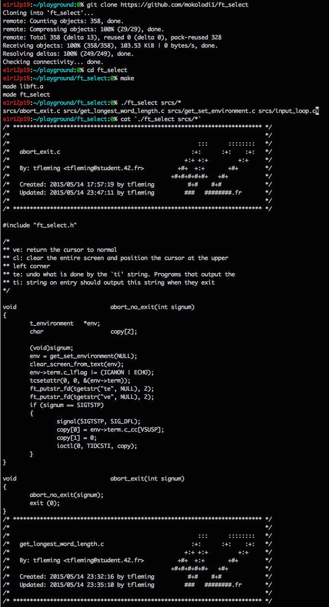
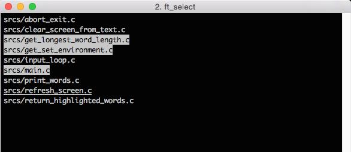
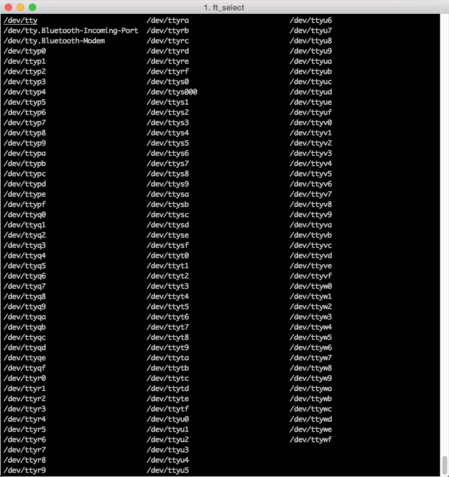

# ft_select: a 42 project

The goal of this project was to create a program that interactively selects and returns arguments. 

Usage examples:
```
emacs `./ft_select srcs/*.c`
```
```
cat `./ft_select *`
```




The arguments are shown in columns if there is not enough space vertically.
The program shows an error message if the window is too small to display all of the arguments. 



Authorized functions:
isatty
- ttyname
- ttyslot
- ioctl
- getenv
- tcsetattr
- tcgetattr
- tgetent
- tgetflag
- tgetnum
- tgetstr
- tgoto
- tputs
- open
- close
- write
- malloc
- free
- read
- exit
- signal
